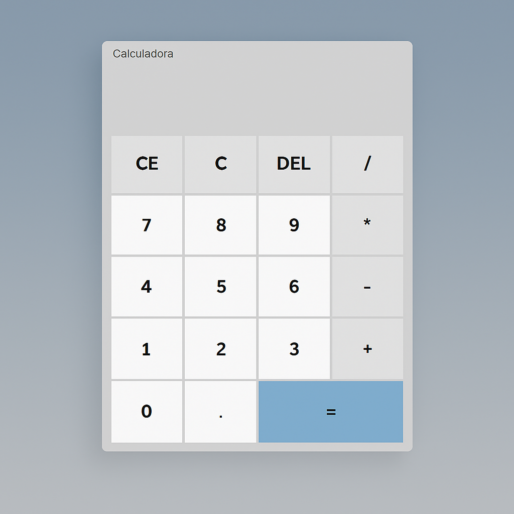

# 🧮 Calculadora Simples

Este é um projeto de uma **calculadora básica**, criada com **HTML, CSS e JavaScript**.  
Ela permite realizar operações simples como **adição, subtração, multiplicação e divisão**.

---

## 📸 Prévia do projeto

---

## 🚀 Tecnologias usadas

- HTML5
- CSS3
- JavaScript

---

## 🔗 Link do projeto

[Acesse aqui a calculadora online](https://eloaguilgel.github.io/CALCULADORA/)

✨ Objetivo
Este projeto foi desenvolvido com fins educacionais, para treinar habilidades em JavaScript e lógica de programação.